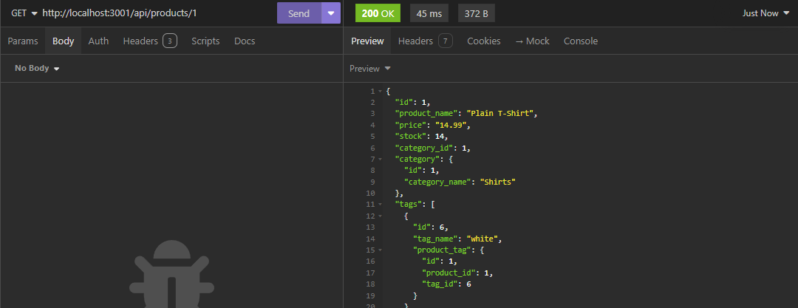

# ecommerce-backend

## Description

The `ecommerce-backend` is a back-end application that provides a RESTful API for managing an e-commerce database. The application is built with Express.js and uses Sequelize as the ORM. The API provides endpoints for creating, reading, updating, and deleting categories, products, and tags.

```md
ecommerce-backend
├── config/
│ └── connection.js
├── db/
│ └── schema.sql
├── models/
├── routes/
│ ├── api/
| └── index.js
├── seeds/
├── server.js
└── README.md
```

### License

MIT License

[](https://opensource.org/licenses/MIT)

## Features

- Create, read, update, and delete categories
- Create, read, update, and delete products
- Create, read, update, and delete tags

## Mock-Up

### Screenshots

The following screenshots show the application's API endpoints in Insomnia:

- Categories

  All Categories
  

  One Category
  

- Products

  All Products
  

  One Product
  

- Tags

  All Tags
  

  One Tag
  

- Post/Update/Delete
  Post
  

  Update
  

  Delete
  

### Demo

The following animation demonstrates the application functionality:

## Learning Outcomes

- Create a back-end application with Express.js
- Use Sequelize as an ORM
- Create a RESTful API
- Use Insomnia to test API endpoints

## Usage

1. Clone the repository

   ```bash
   git clone
   ```

2. Install dependencies

   ```bash
   npm install
   ```

3. Create the database

   ```bash
   psql -U postgres

   *enter password*

   \i schema.sql;
   ```

4. Seed the database

   ```bash
   npm run seed
   ```

5. Start the server

   ```bash
   npm start
   ```

6. Test the API endpoints in Insomnia
